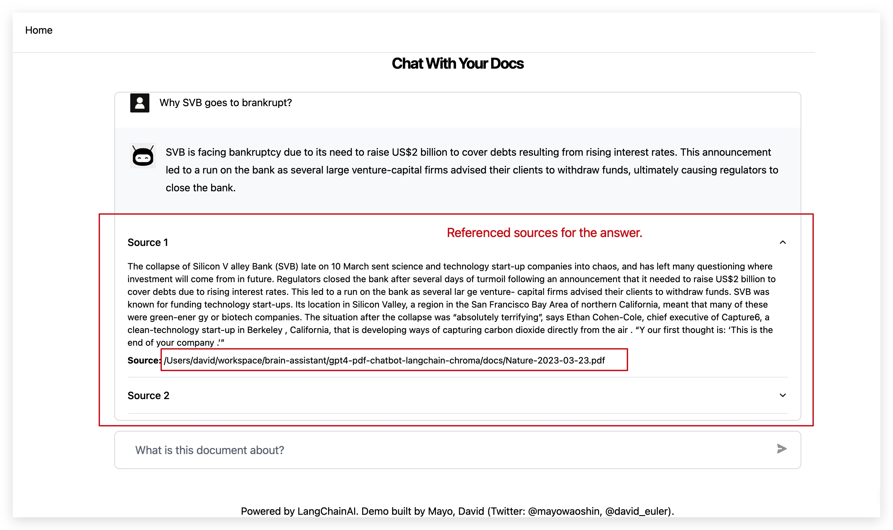
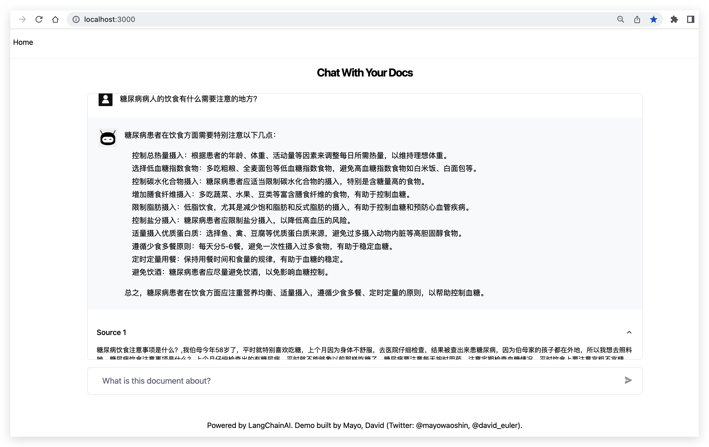

# GPT-4 & LangChain - Create a ChatGPT Chatbot for Your PDF Files

Use the new GPT-4 api to build a chatGPT chatbot for multiple Large PDF files, docx, pptx, html, txt, csv.

Tech stack used includes LangChain, Chroma, Typescript, Openai, and Next.js. LangChain is a framework that makes it easier to build scalable AI/LLM apps and chatbots. Chroma is a vectorstore for storing embeddings and your PDF in text to later retrieve similar docs.

[Tutorial video using the Pinecone db instead of the opensource Chroma db](https://www.youtube.com/watch?v=ih9PBGVVOO4)

The visual guide of this repo and tutorial is in the `visual guide` folder.

**If you run into errors, please review the troubleshooting section further down this page.**

Prelude: Please make sure you have already downloaded node on your system and the version is 18 or greater.

## Features

- Support for multiple file formats: docx, pptx, html, txt, csv.
- Support for multiple files. Just put your files to docs folder, and run ```npm run ingest```.
- Both GPT-3.5, GPT-4 are available. GPT-4 is recommended for better answer, while with slower response.
- Open source chromadb as vector database, you don't need to send your data to a cloud commercial vectordb.

## Deployment

1. Clone the repo or download the ZIP

```
git clone [github https url]
```


2. Install packages

First run `npm install yarn -g` to install yarn globally (if you haven't already).

Then run:

```
yarn install
```
After installation, you should now see a `node_modules` folder.

3. Set up your `.env` file, and prepare chromadb server on your host.

- Copy `.env.example` into `.env`
  Your `.env` file should look like this:

```
OPENAI_API_KEY=
COLLECTION_NAME=
```

Note, the collection name must be an UUID which can be generated by ```uuid``` command in Linux/Mac.

- Visit [openai](https://help.openai.com/en/articles/4936850-where-do-i-find-my-secret-api-key) to retrieve API keys and insert into your `.env` file.

- Visit [chroma](https://docs.trychroma.com/getting-started#2-get-the-chroma-client) to run the chroma client locally using Docker.
```
git clone git@github.com:chroma-core/chroma.git
cd chroma
docker-compose up -d --build
```

4. In the .env file, replace the `COLLECTION_NAME` with a `namespace` where you'd like to store your embeddings on Chroma when you run `npm run ingest`. This namespace will later be used for queries and retrieval.

5. In `utils/makechain.ts` chain change the `QA_PROMPT` for your own usecase. Change `modelName` in `new OpenAI` to `gpt-4`, if you have access to `gpt-4` api. Please verify outside this repo that you have access to `gpt-4` api, otherwise the application will not work.

## Convert your PDF files to embeddings

**This repo can load multiple PDF files, and other files such as docx, pptx, txt, csv, html**

1. Inside `docs` folder, add your pdf files or folders that contain pdf/docx/pptx files. There is an example legal case file in the docs folder already.

2. Run the script `npm run ingest` to 'ingest' and embed your docs. If you run into errors troubleshoot below.

3. Check the Chroma docker instance's dashboard log to verify a sucessful POST request has been made to the server.

## Run the app

Once you've verified that the embeddings and content have been successfully added to your Chroma, you can run the app `npm run dev` to launch the local dev environment, and then type a question in the chat interface.

```
http://localhost:3000
```


## Snapshot of the product





Just a few steps to deploy your server, prepare your files, and you can chat with your docs.


## Troubleshooting

In general, keep an eye out in the `issues` and `discussions` section of this repo for solutions.

**General errors**

- Make sure you're running the latest Node version. Run `node -v`
- Try a different PDF or convert your PDF to text first. It's possible your PDF is corrupted, scanned, or requires OCR to convert to text.
- `console.log` the `env` variables and make sure they are exposed.
- Make sure you're using the same versions of LangChain and Chroma as this repo.
- Check that you've created an `.env` file that contains your valid (and working) API keys, environment and index name.
- If you change `modelName` in `OpenAI`, make sure you have access to the api for the appropriate model.
- Make sure you have enough OpenAI credits and a valid card on your billings account.
- Check that you don't have multiple OPENAPI keys in your global environment. If you do, the local `env` file from the project will be overwritten by systems `env` variable.
- Try to hard code your API keys into the `process.env` variables if there are still issues.

## Credit

Frontend of this repo is inspired by [gpt4-pdf-chatbot-langchain](https://github.com/mayooear/gpt4-pdf-chatbot-langchain), and [gpt4-pdf-chatbot-langchain-chroma](https://github.com/sagarsaija/gpt4-pdf-chatbot-langchain-chroma)
